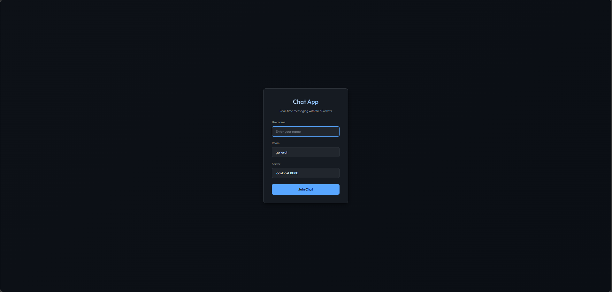
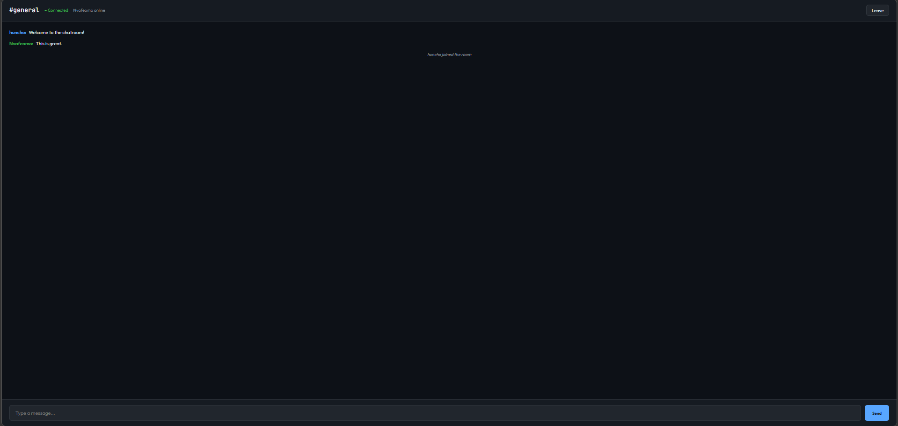

# Chat App

A real-time, multi-room chat you can run locally or in Docker. It started as a group exercise: a C TCP server with pthreads on a Linux VM. I later added a **Go** WebSocket server with channels and goroutines, a **React + Vite** client, and a **Node** backend for anyone who does not want to install Go. The original POSIX implementation is still in `c-server/` if you want to compare approaches. Building this gave me a small end-to-end surface for WebSockets, concurrent connection handling, and a simple lobby → room UX.

## What it does

- **Rooms:** Create or join a room by name; everyone in the same room sees the same message stream.
- **Real-time:** WebSockets for instant delivery; your own messages are styled differently from others in the UI.
- **Resilience:** Reconnect flow and a live member count when the server sends room updates.
- **Backends:** Primary **Go** server, drop-in **Node** alternative, optional **Docker** compose for one-command runs.
- **C variant (Linux/WSL):** Classic sockets + pthreads client/server pair for contrast with the Go design.

## Stack

**Go 1.21+ · Gorilla WebSocket · React 18 · TypeScript · Vite · Node.js (optional server) · Docker (optional) · C + pthreads (`c-server/`, POSIX only)**

## Demo

**Lobby — pick a username and room**



**Chat room**




## Run locally

You will need **Node.js 18+** (LTS is fine). For the default backend you also need **Go 1.21+**, or use the Node server instead. **Docker** is optional but handy for a full stack in one command.

### Docker (simplest)

```bash
docker compose up --build
```

- **Client:** http://localhost:3000  
- **Server:** http://localhost:8080  

### Go server + React client

**Terminal 1 — backend**

```bash
cd server
go run .
```

**Terminal 2 — frontend**

```bash
cd client
npm install
npm run dev
```

Open **http://localhost:5173**, enter a username and room (e.g. `general`), then join. All participants must use the **same room name** to see each other.

From the repo root you can start only the client with `npm run dev:client` (still run the Go server separately).

### No Go? Use the Node server

```bash
cd server-node
npm install
npm start
```

Use the same `client` steps as above (`npm install` and `npm run dev` in `client/`).

## C server (Linux / WSL only)

The C code uses POSIX sockets and pthreads; it does not build as-is on native Windows. Use WSL or Linux.

```bash
cd c-server
make
./server 8080           # terminal 1
./client localhost 8080 # terminal 2
```

The server sends `-1` to clients when it is full. Stop with Ctrl+C.

## Project layout

```
├── server/          # Go WebSocket server
├── server-node/     # Node.js alternative (no Go required)
├── client/          # React + Vite frontend
├── c-server/        # Original C implementation (POSIX)
└── screenshots/     # UI screenshots for this README
```

## Troubleshooting

- **Port 8080 in use (Windows):** `netstat -ano | findstr :8080` to find the PID, then `taskkill /PID <pid> /F`.
- **Messages not appearing:** Confirm both clients joined the **same** room name.
- **WebSocket errors:** Ensure the Go (or Node) server is running and the lobby server URL matches (e.g. `http://localhost:8080`).

## License

MIT
